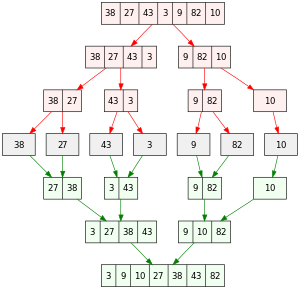

## 1. What is merge sort?


Merge sort is an algorithm that divides the array into two equal parts recursively, sorts each part, and then combines them.

- **Worst complexity**: \\( O(n \log n) \\)

- **Average complexity**: \\( O(n \log n) \\)
- **Best complexity**: n
- **Space complexity**: 1
## 2. Implementation

```python

# The provided code implements the merge sort algorithm to sort an array.
def do_merge(l_arr, r_arr):
    # Sorting the left and right subarrays using merge sort recursively.
    l_arr = merge_sort(l_arr)
    r_arr = merge_sort(r_arr)
    # Printing the left and right subarrays.
    print("left: ", l_arr)
    print("right: ", r_arr)
    # Combining the sorted subarrays into a new sorted array.
    rs = []
    left_idx = 0
    right_idx = 0

    while left_idx < len(l_arr) or right_idx < len(r_arr):
        if left_idx == len(l_arr):
            rs.append(r_arr[right_idx])
            right_idx += 1
        elif right_idx == len(r_arr):
            rs.append(l_arr[left_idx])
            left_idx += 1

        elif l_arr[left_idx] < r_arr[right_idx]:
            rs.append(l_arr[left_idx])
            left_idx += 1
        else:
            rs.append(r_arr[right_idx])
            right_idx += 1
    # Printing the resulting merged array and a separator.
    print("result: ", rs)
    print("-------------------")
    return rs


def merge_sort(arr):
    # Base case: if the array has only one element, it is already sorted.
    if len(arr) == 1:
        return arr
    else:
        # Dividing the array into two halves.
        pivot = int(len(arr) / 2)
        left_part = arr[:pivot]
        right_part = arr[pivot:]
        # Sorting the subarrays using merge sort recursively.
        result = do_merge(left_part, right_part)
        return result


if __name__ == "__main__":
    arr = [1, -9, 33]
    print("Input array: ", arr)
    print("Sorted array: ", merge_sort(arr))

```
